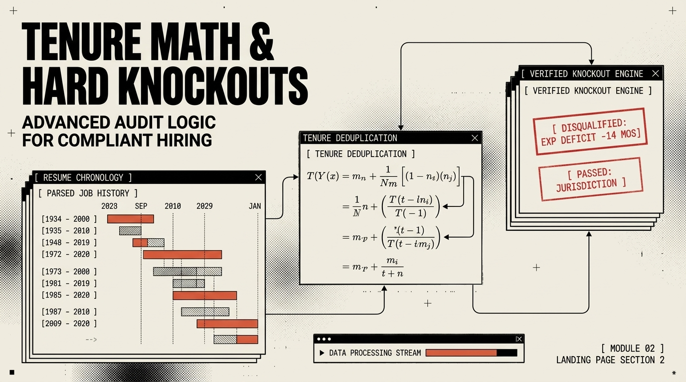
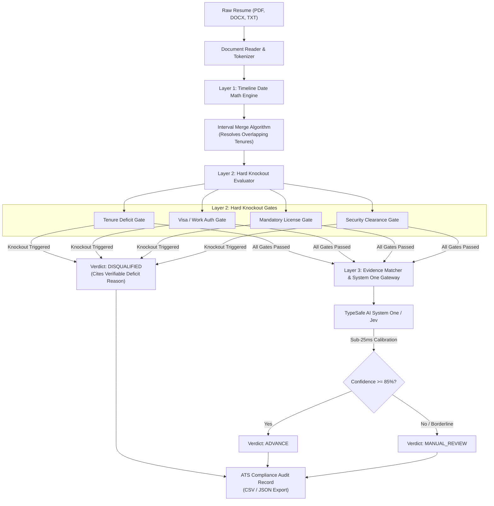

# ⚖️ Precision ATS Resume Disqualifier

> **Deterministic Applicant Tracking System (ATS) Disqualification Engine powered by TypeSafe AI System One & Jev Decision Intelligence.**  
> *Non-overlapping calendar tenure math, hard knockout verification gates, and court-proof EEOC/OFCCP compliance audit trails.*

[](https://www.python.org/downloads/)
[](#architecture)
[](#typesafe-ai-system-one-integration)
[](#legal-compliance--eeocofccp-protection)
[](LICENSE)

---


---

## 📌 Executive Summary & The Problem

Standard Generative AI and LLM-based resume screeners fail in enterprise recruiting for two fatal reasons:

1. **Date Math Hallucination:** LLMs cannot perform reliable calendar arithmetic. Overlapping internships, concurrent freelance gigs, and dual degrees trick generative models into calculating 8 years of experience when a candidate only has 3.2 true calendar years.
2. **Legal & Regulatory Liability (EEOC & OFCCP):** Vague LLM rejections ("*The candidate lacked leadership presence*") expose organizations to devastating disparate-impact litigation. Corporate legal and compliance teams demand objective, verifiable, and cited disqualification criteria.

**Precision ATS Resume Disqualifier** solves this by separating **deterministic facts** from **probabilistic inference**:
* **Layer 1 (Chronological Math):** Parses dates into interval sets and merges overlaps to calculate verified calendar tenure down to decimal years.
* **Layer 2 (Hard Knockouts):** Executes binary dealbreaker gates (Total Tenure, Work Authorization/Visa, Mandatory Licensure, Security Clearances).
* **Layer 3 (Calibrated System One Gateway):** Evaluates nuanced domain competencies via **TypeSafe AI System One / Jev** in sub-25ms with calibrated confidence metrics and zero generative drift.

---

## 🖥️ Interactive Recruiter Cockpit

The system includes a high-throughput, Swiss Industrial Newsprint Recruiter Cockpit engineered with **0px border-radius brutalist geometry**, tactical monospace typography, and responsive split-screen ergonomics:


### Key Capabilities
* **Dynamic Job Description Decomposition:** Paste any Job Description (JD); the system decomposes it into structured knockouts and weighted competencies automatically.
* **Multi-Format Batch Ingestion:** Drag-and-drop batch resume uploads supporting **PDF**, **DOCX**, **TXT**, and **Markdown**.
* **Instant Knockout Rule Toggling:** Add, enable, disable, or delete custom dealbreaker rules with real-time candidate re-evaluations.
* **One-Click Verifiable Rejection Letters:** Generate legally defensive rejection notices citing exact prerequisite deficits and verbatim resume snippets.
* **1-Click Audit Exports:** Export full candidate rosters to **CSV** and **JSON** with complete audit trails, timestamps, and model decision telemetry.

---

## 🏛️ System Architecture





---

## 🛡️ Legal Compliance & EEOC/OFCCP Protection

When candidates are disqualified, the Recruiter Cockpit opens an immutable audit modal documenting the exact statutory ground for rejection:


* **Verbatim Evidence Linking:** Every disqualification pairs the active job requirement with the exact quote or verifiable absence in the candidate's chronology.
* **Zero Disparate Impact:** Disqualifications are based strictly on objective prerequisites (e.g., *Active Illinois RN License Required*, *5.0+ Calendar Years Required - Candidate has 1.8 Years*).
* **Audit-Proof Documentation:** Every decision includes ISO-8601 timestamps, model versions, and raw text citations ready for compliance audits.

---

## ⚡ TypeSafe AI System One Integration


The decision engine connects directly to the **TypeSafe AI System One** decision gateway (`jev-latest`):
* **Sub-25ms Gating:** Executes instantaneous non-autoregressive decision classification instead of burning 1.5s+ and tokens on slow LLMs.
* **Calibrated Confidence:** Yields probability distributions on competence match rather than vague narrative text.
* **Graceful Local Fallback:** When offline or unconfigured, runs high-speed local keyword and regex heuristic scoring without crashing.

---

## 🚀 Quickstart & Installation

### 1. Prerequisites
* Python 3.10 or higher
* Git

### 2. Clone the Repository
```bash
git clone https://github.com/AiPersonacademy/precision-ats-resume-disqualifier.git
cd precision-ats-resume-disqualifier
```

### 3. Install Dependencies
```bash
pip install -r requirements.txt
```

### 4. Configure TypeSafe AI Credentials (Optional)
To enable real-time sub-25ms System One decision telemetry:
```bash
# Windows PowerShell
$env:TYPESAFE_API_KEY="your_typesafe_api_key_here"

# Linux / macOS
export TYPESAFE_API_KEY="your_typesafe_api_key_here"
```
*(You can also configure or test your API key live inside the Recruiter Cockpit GUI at runtime.)*

### 5. Launch the Cockpit Server
```bash
python gui/server.py
```
Open **[http://localhost:8990](http://localhost:8990)** in your browser.

---

## 📂 Included Sample Resumes

Out of the box, the `data/sample_resumes/` folder contains pre-built test candidates for instant testing:

| File | Candidate | Target Role | Expected Verdict | Verified Reason |
| :--- | :--- | :--- | :---: | :--- |
| `elena_senior_backend.txt` | Elena Rostova | Senior Go Engineer | **ADVANCE** | 7.2 years verified tenure; meets all distributed systems & Go criteria. |
| `alex_junior_dev.txt` | Alex Morgan | Senior Go Engineer | **DISQUALIFIED** | 1.8 years total tenure (Deficit: 3.2 years below 5.0y minimum requirement). |
| `rajesh_visa_ineligible.txt` | Rajesh Patel | Senior Go Engineer | **DISQUALIFIED** | Explicitly requires H1B visa transfer on a role with strict no-sponsorship policy. |
| `sarah_nurse_no_license.txt` | Sarah Jenkins | ICU Staff RN | **DISQUALIFIED** | CNA credential holder missing mandatory state Registered Nurse (RN) license. |
| `marcus_cloud_sre.docx` | Marcus Vance | Lead Cloud SRE | **ADVANCE / REVIEW** | Multi-year Kubernetes experience in Microsoft Word DOCX format. |

---

## 🔌 REST API Endpoints

| Endpoint | Method | Description |
| :--- | :---: | :--- |
| `/api/profile` | `GET` | Fetches active job profile, criteria, and system status. |
| `/api/update_jd` | `POST` | Decomposes raw JD text into knockouts and competencies. |
| `/api/load_sample_jd` | `POST` | Switches between pre-configured job templates (Go, RN, Cyber). |
| `/api/add_knockout` | `POST` | Adds a custom knockout rule dynamically. |
| `/api/toggle_knockout` | `POST` | Enables or disables an individual knockout rule. |
| `/api/delete_knockout` | `POST` | Deletes a custom knockout rule. |
| `/api/candidates` | `GET` | Returns list of evaluated candidate dossiers. |
| `/api/upload_resumes` | `POST` | Multi-part file upload handler (PDF, DOCX, TXT, MD). |
| `/api/evaluate_text` | `POST` | Evaluates directly pasted resume text. |
| `/api/test_api_key` | `POST` | Tests live latency and connectivity to TypeSafe System One. |
| `/api/export_csv` | `GET` | Downloads complete legal compliance audit in CSV format. |
| `/api/export_json` | `GET` | Downloads full audit dossier in JSON format. |

---

## 🧪 Automated Test Suite

Run the full end-to-end test suite to verify calendar date math, DOCX parsing, and knockout rules:

```bash
python -m unittest discover tests -v
```

All tests execute locally with zero external network dependencies.

---

## 📄 License & Attribution

Distributed under the **MIT License**. Engineered for high-compliance talent acquisition teams and high-scale recruiting operations by **AIPersona Academy (APA)**.
