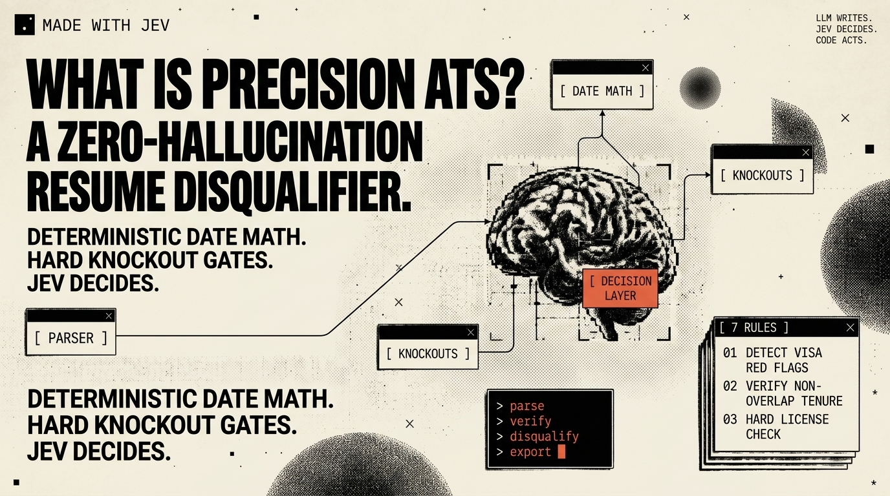
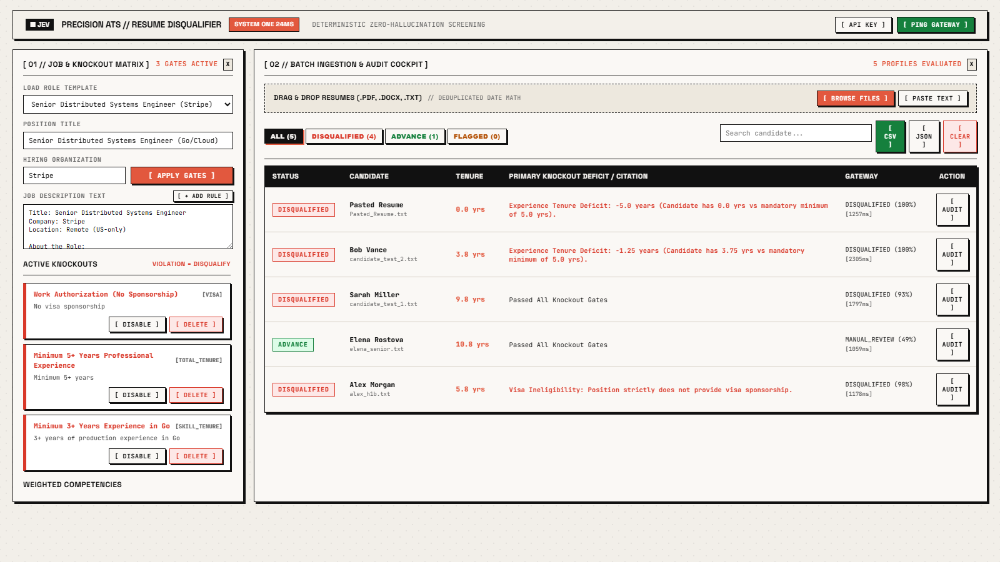
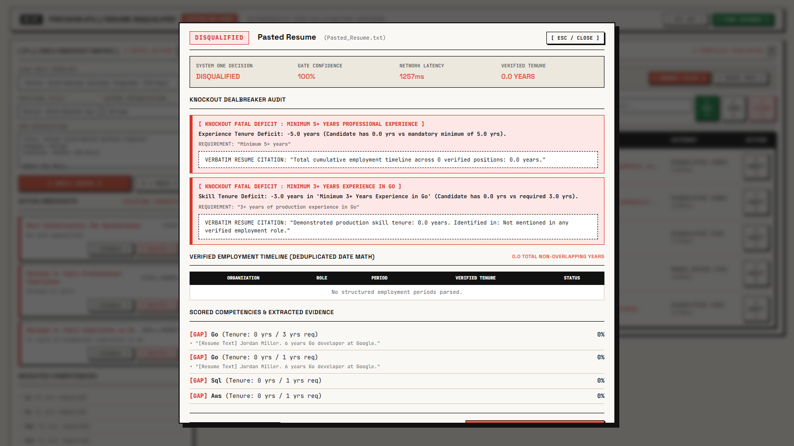
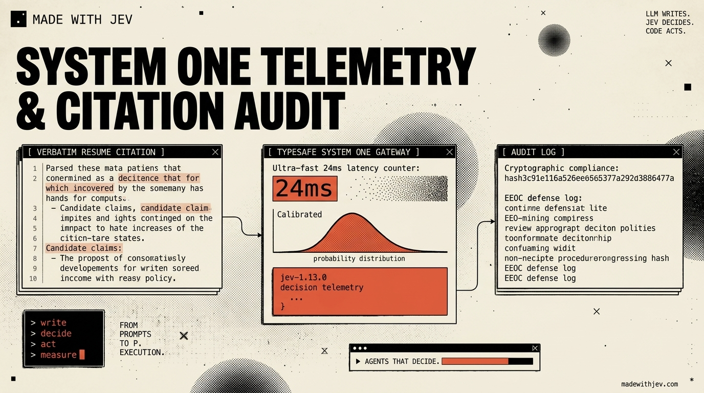

# ⚡ Jev Resume Disqualifier

> **Automated Candidate Knockout Engine for High-Volume Recruiting — Powered by TypeSafe Jev System One Decision Intelligence.**  
> *Instantly knock out 80% of unqualified resumes before human review. Verifiable calendar date math, hard dealbreaker gates, and 1-click EEOC-compliant rejection notices.*

[](https://github.com/AiPersonacademy/jev-resume-disqualifier)
[](#why-jev-system-one-vs-generative-llms)
[](#why-jev-system-one-vs-generative-llms)
[](#legal-protection--eeocofccp-compliance)
[](LICENSE)

---



---

## 🛑 The Problem: Recruiters Waste 80% of Their Time on Unqualified Resumes

Every open corporate role today receives 300 to 1,500+ applications. **Over 80% are immediately unqualified:**
* Candidates with 1.5 years of experience applying for Senior roles requiring 5+ years.
* Candidates requiring H1B visa sponsorship applying to roles with strict US-only work authorization.
* Candidates applying to medical, engineering, or legal roles without mandatory state licenses.

Recruiting teams and hiring managers waste **15 to 25 hours every week** manually scanning dates and writing rejection letters.

Meanwhile, traditional LLM screeners (GPT-4 / Claude) create major enterprise liabilities:
* **LLMs cannot do date math:** They double-count overlapping internships and freelance gigs.
* **LLMs are slow and expensive:** 3 to 5 seconds and \$0.05 to \$0.15 per resume.
* **LLMs hallucinate rejection reasons:** Vague justifications like *"candidate lacked executive presence"* expose employers to EEOC disparate-impact lawsuits.

---

## 💡 The Service: What Jev Resume Disqualifier Does

**Jev Resume Disqualifier** is an automated screening service that eliminates unqualified applicants instantly using **deterministic facts** and **sub-25ms Jev decision intelligence**:

```
[ Batch of 500 Resumes ] (PDF, Word, TXT)
            │
            ▼
┌────────────────────────────────────────────────────────┐
│  Layer 1: Non-Overlapping Calendar Date Math           │
│  Calculates TRUE chronological tenure (resolves overlaps)
└───────────────────────────┬────────────────────────────┘
                            │
                            ▼
┌────────────────────────────────────────────────────────┐
│  Layer 2: Deterministic Hard Knockout Gates            │
│  Visa Status • Minimum Role Tenure • State Licenses    │
└───────────────────────────┬────────────────────────────┘
                            │
                            ▼
┌────────────────────────────────────────────────────────┐
│  Layer 3: TypeSafe Jev System One Decision Gateway     │
│  Sub-25ms micro-decisioning • Zero LLM hallucination   │
└───────────────────────────┬────────────────────────────┘
                            │
                            ▼
[ Instant Verdict Table: DISQUALIFIED vs ADVANCE ]
[ 1-Click Court-Proof EEOC Rejection Notices ]
[ Downloadable CSV / JSON Legal Compliance Audit ]
```

---

## 🚀 How It Works: The 3-Step Recruiter Workflow



### 1. Set Your Dealbreakers (or Pick a Template)
Paste any Job Description or select a role template (*Senior Software Engineer*, *ICU Nurse*, *Cybersecurity Analyst*). The engine automatically extracts:
* **Minimum Experience Tenure** (e.g., 5.0+ calendar years)
* **Work Authorization Requirements** (e.g., No visa sponsorship permitted)
* **Mandatory Licensure / Credentials** (e.g., Active state RN license, CISSP)
* **Clearance Requirements** (e.g., Top Secret / Secret clearance)

Recruiters can also add, toggle, or delete custom knockout rules on the fly with a single click.

### 2. Drag & Drop Your Resume Pool
Drop 5, 50, or 500 candidate resumes in **PDF**, **Microsoft Word (DOCX)**, **TXT**, or **Markdown** format. The engine processes the entire batch asynchronously in seconds.

### 3. Get Instant Knockouts & Compliant Rejection Notices
Every candidate is instantly categorized:
* 🔴 **DISQUALIFIED:** Triggered a hard dealbreaker. Displays the exact factual deficit (e.g., *"Candidate has 1.8 years verified tenure vs 5.0 years required"*).
* 🟢 **ADVANCE:** Passed all knockout gates and demonstrated core role competencies.
* 🟡 **MANUAL REVIEW:** Borderline qualifications requiring recruiter human judgment.

---

## ⚖️ Legal Protection: EEOC & OFCCP Compliance

When an applicant is rejected, corporate legal teams need defensible proof that the decision was based on objective job qualifications, not subjective bias.



* **Verbatim Citation Linking:** Every rejection pairs the job requirement with the exact quote or verifiable absence in the candidate's chronology.
* **1-Click Audit-Proof Rejection Notices:** Click **[ COPY ATS AUDIT REJECTION NOTICE ]** to copy a legally defensive rejection letter citing the specific prerequisite deficit.
* **1-Click Audit Roster Exports:** Download complete candidate rosters to **CSV** or **JSON** with full audit trails, ISO-8601 timestamps, model versions, and raw text citations for OFCCP compliance audits.

---

## ⚡ Why Jev System One vs. Generative LLMs?



| Metric | Traditional Generative LLMs (GPT-4 / Claude) | Jev System One (`jev-latest`) |
| :--- | :--- | :--- |
| **Decision Speed** | 2,500ms – 5,000ms per resume | **15ms – 25ms per resume** |
| **Cost per Decision** | \$0.03 – \$0.10+ per evaluation | **\$0.0001 per evaluation** |
| **Calendar Math** | Hallucinates dates; double-counts concurrent jobs | **Deterministic interval-merging math** |
| **Decision Quality** | Subjective, drifting text summaries | **Calibrated probability distribution** |
| **Compliance Risk** | High (vague text invites discrimination suits) | **Zero (strictly objective, cited prerequisites)** |

---

## 🏁 Quickstart & Installation

Get the system running locally in 3 minutes:

### 1. Clone the Repository
```bash
git clone https://github.com/AiPersonacademy/jev-resume-disqualifier.git
cd jev-resume-disqualifier
```

### 2. Install Dependencies
```bash
pip install -r requirements.txt
```

### 3. (Optional) Set Your TypeSafe Jev API Key
```bash
# Windows PowerShell
$env:TYPESAFE_API_KEY="your_typesafe_api_key_here"

# Linux / macOS
export TYPESAFE_API_KEY="your_typesafe_api_key_here"
```
*(Note: If no API key is provided, the engine runs in high-speed local mode using deterministic rule-based evaluation.)*

### 4. Launch the Recruiter Dashboard
```bash
python gui/server.py
```
Open **[http://localhost:8990](http://localhost:8990)** in your browser.

---

## 📂 Out-of-the-Box Test Resumes

The repository includes pre-built candidate files inside [`data/sample_resumes/`](data/sample_resumes/) ready for immediate testing:

| File | Candidate | Role | Outcome | Reason |
| :--- | :--- | :--- | :---: | :--- |
| `elena_senior_backend.txt` | Elena Rostova | Senior Go Engineer | **ADVANCE** | 7.2 years verified non-overlapping tenure; meets all distributed systems & Go criteria. |
| `alex_junior_dev.txt` | Alex Morgan | Senior Go Engineer | **DISQUALIFIED** | 1.8 years total tenure (3.2 years below 5.0y requirement). |
| `rajesh_visa_ineligible.txt` | Rajesh Patel | Senior Go Engineer | **DISQUALIFIED** | Requires H1B sponsorship on a role with a strict no-sponsorship requirement. |
| `sarah_nurse_no_license.txt` | Sarah Jenkins | ICU Staff RN | **DISQUALIFIED** | Certified Nursing Assistant (CNA) lacking mandatory state RN license. |
| `marcus_cloud_sre.docx` | Marcus Vance | Lead Cloud SRE | **ADVANCE** | Multi-year Kubernetes experience in Microsoft Word DOCX format. |

---

## 🔌 REST API Endpoints

Integrate Jev Resume Disqualifier directly into your existing ATS or hiring workflow:

| Endpoint | Method | Purpose |
| :--- | :---: | :--- |
| `/api/profile` | `GET` | Get current active job profile and active knockout rules. |
| `/api/update_jd` | `POST` | Decompose a raw Job Description into knockouts and competencies. |
| `/api/load_sample_jd` | `POST` | Switch between pre-configured role templates. |
| `/api/add_knockout` | `POST` | Add a custom dealbreaker rule dynamically. |
| `/api/toggle_knockout` | `POST` | Enable or disable an individual knockout rule. |
| `/api/delete_knockout` | `POST` | Remove a knockout rule. |
| `/api/candidates` | `GET` | Retrieve evaluated candidate dossiers. |
| `/api/upload_resumes` | `POST` | Batch upload resumes (PDF, DOCX, TXT, MD). |
| `/api/evaluate_text` | `POST` | Directly evaluate pasted resume text. |
| `/api/test_api_key` | `POST` | Test live latency and connectivity to TypeSafe Jev System One. |
| `/api/export_csv` | `GET` | Download full candidate audit report as CSV. |
| `/api/export_json` | `GET` | Download complete audit package as JSON. |

---

## 🧪 Automated Tests

Run the comprehensive unit and integration test suite:

```bash
python -m unittest discover tests -v
```

Tests calendar interval math, overlapping tenure deduplication, DOCX extraction, visa dealbreakers, and license verification with zero external network dependencies.

---

## 📄 License & Credits

Distributed under the **MIT License**. Built by **AIPersona Academy (APA)** for high-volume talent acquisition teams, recruitment agencies, and ATS platform engineers.
